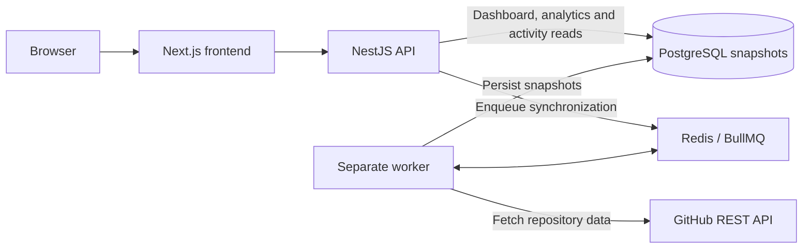

# ProjectPulse

ProjectPulse is a GitHub repository and engineering analytics dashboard for tracked public repositories. It collects repository observations in a background worker, persists snapshots to PostgreSQL, and uses those snapshots to serve an engineering overview, repository trends, and activity history.

**Live application:** [pulse.pat1.online](https://pulse.pat1.online) · **API health:** [api.pulse.pat1.online/health](https://api.pulse.pat1.online/health)

**Technology:** Next.js · React · TypeScript · NestJS · Prisma · PostgreSQL · Redis · BullMQ · Coolify/Nixpacks

## Why ProjectPulse

GitHub provides current repository data, but historical engineering analytics require collecting and persisting observations over time. Fetching the same GitHub data on every dashboard load adds latency and consumes API rate limits without creating a durable history.

ProjectPulse separates reads from synchronization: the API primarily serves stored snapshots, while a separate worker fetches GitHub data asynchronously. Redis/BullMQ connects the API to the worker and provides deduplication, retries, and backoff. PostgreSQL stores the observations needed to build historical trends.

## Highlights

- PostgreSQL-backed dashboard and repository metric snapshots, written together in a transaction.
- Historical repository analytics using the last snapshot per UTC day for chart points.
- BullMQ synchronization with per-user deduplication and exponential retry backoff.
- Separate API and worker runtimes, with refresh work scheduled every 15 minutes.
- Snapshot-derived activity history and GitHub OAuth sign-in.
- Self-hosted deployment with separate Web, API, Worker, PostgreSQL, and Redis resources.

## Architecture



The scheduler runs in the API process; the worker consumes queued jobs without opening an HTTP server. OAuth and repository discovery also call GitHub from the API. If a user tracks repositories but has no dashboard snapshot, the first dashboard request performs a live fallback sync and persists its result. Subsequent dashboard reads use the latest stored snapshot; analytics and activity reads use stored history only.

## Snapshot model

Each synchronization aggregates a user's tracked repositories into a `DashboardSnapshot`: overall metrics, a capture timestamp, and recent activity JSON. Related `RepositoryMetricSnapshot` rows store repository-level observations such as open issues, open pull requests, and commits in the preceding seven days.

Every 15 minutes, the API scheduler queues one refresh for each user with tracked repositories. Tracking or untracking also attempts to queue an immediate refresh. The worker retrieves GitHub data and saves a new snapshot; existing snapshots remain available for reads if a later refresh fails.

Historical analytics use accumulated observations, rather than reconstructing old metric values from today's GitHub response. A newly tracked repository therefore has little or no metric history. The 7d / 30d / 90d views become more useful as snapshots accumulate; missing days are not backfilled.

Recent GitHub changes may take roughly one synchronization interval to appear under normal operation. Queue delays, retries, or upstream failures can extend that delay. Snapshot retention and stored daily rollups are not implemented; daily chart reduction currently happens at read time.

## Features

- GitHub OAuth authentication with an application session cookie.
- Discover and track public repositories returned by the signed-in user's GitHub repository listing; private repositories are not supported.
- Engineering overview: open issues, open pull requests, seven-day commits, and active GitHub contributor logins from the preceding 30 days.
- Repository-specific analytics with SVG trends for open issues, open pull requests, and seven-day commit counts across 7d / 30d / 90d ranges.
- Activity history for commits, opened issues, and merged pull requests, with range, event-type, and repository filters.

Activity is an observed history, not a complete event archive: each dashboard snapshot retains only its ten newest activity entries. The activity endpoint deduplicates stored entries and returns at most 100 matching events. Historical commit-count chart points each represent a rolling seven-day count, not a daily commit total.

## Tech stack

| Area | Technologies |
| --- | --- |
| Frontend | Next.js 16.3.7, React 19.2.8, TypeScript, Tailwind CSS 4 |
| API | NestJS 12, TypeScript, Prisma 6, PostgreSQL |
| Background processing | Redis, BullMQ, separate NestJS worker context |
| Validation | Vitest and oxlint for the API; ESLint for the frontend |
| Deployment | Coolify, Nixpacks, npm |
| Integration | GitHub REST API and OAuth |

## Production deployment

The project runs as a self-hosted Coolify deployment. [Issue #7](https://github.com/patinen/projectpulse/issues/7) records that the web and API URLs are live and that API, worker, PostgreSQL, and Redis are production resources; [issue #1](https://github.com/patinen/projectpulse/issues/1) records automatic deployment through Coolify. These are repository-reported deployment facts, not a claim of a fresh end-to-end production test.

| Resource | Role / exposure | Runtime |
| --- | --- | --- |
| Web | Public frontend at `https://pulse.pat1.online` | `web`: `npm run build`, then `npm run start` |
| API | Public HTTP API at `https://api.pulse.pat1.online`; health at `/health` | `api`: Prisma generation and build, then `npm run start:prod:migrate` |
| Worker | Background synchronization; no public domain or HTTP port | Same API build, then `npm run start:worker` |
| PostgreSQL | Dedicated private persistence shared by API and worker | Users, tracked repositories, encrypted token material, snapshots |
| Redis | Dedicated private queue shared by API and worker | BullMQ jobs |

The API startup command applies committed Prisma migrations before serving traffic. The worker starts `dist/worker.js` and does not run migrations. API and worker require **Node >=22.22.3 <23**; `api/nixpacks.toml` pins the Nixpkgs archive used for a compatible Node build environment.

Production OAuth callback: `https://api.pulse.pat1.online/auth/github/callback`. Set `NEXT_PUBLIC_API_URL=https://api.pulse.pat1.online` during the frontend build; changing it only at runtime does not update the built browser bundle.

Database and Redis connection strings, OAuth client secrets, session secrets, and token encryption keys stay server-side. Stored GitHub access tokens are encrypted with AES-256-GCM using the configured 32-byte key. The OAuth authorization URL requests no explicit additional scopes. See the [API operator guide](api/README.md#production-runtime) for runtime settings and environment details.

## Local development

Prerequisites: Node **>=22.22.3 <23**, npm, Docker with Compose, and a GitHub OAuth App. Run commands from the repository root unless a step changes directory.

1. Install API dependencies, copy the environment template, and start local PostgreSQL and Redis:

   ```bash
   cd api
   npm ci
   cp .env.example .env
   docker compose up -d
   ```

   In PowerShell, use `Copy-Item .env.example .env`. Compose publishes ports 5432 and 6379 for local development; this is separate from the private production topology.

2. Configure the OAuth App with homepage `http://localhost:3000` and callback `http://localhost:3001/auth/github/callback`. Fill `GITHUB_CLIENT_ID` and `GITHUB_CLIENT_SECRET` in `api/.env`. Keep the template's local `GITHUB_CALLBACK_URL`, `WEB_URL`, and `CORS_ORIGIN` values.

   Run this command twice to generate separate local values for `AUTH_SESSION_SECRET` and `GITHUB_TOKEN_ENCRYPTION_KEY`:

   ```bash
   node -e "console.log(require('node:crypto').randomBytes(32).toString('base64'))"
   ```

   The encryption key must decode from base64 to exactly 32 bytes. Keep your `.env` files uncommitted. There is no authentication bypass; sign in through GitHub.

3. Generate the Prisma client, apply local migrations, and start the API:

   ```bash
   # In api/
   npm run db:generate
   npm run db:migrate
   npm run start:dev
   ```

4. In a separate terminal, start the worker using the same API environment:

   ```bash
   cd api
   npm run start:worker:dev
   ```

5. In another terminal, set up and start the frontend:

   ```bash
   cd web
   npm ci
   cp .env.example .env.local
   npm run dev
   ```

   In PowerShell, use `Copy-Item .env.example .env.local`. Open [localhost:3000](http://localhost:3000); the API defaults to [localhost:3001](http://localhost:3001). Sign in, open Repositories, and track a public repository to begin collecting snapshots.

See [api/README.md](api/README.md) for endpoints and synchronization details, and [web/README.md](web/README.md) for frontend configuration.

## Testing

Run the package scripts from their respective directories with the required Node version:

```bash
cd api
npm ci
npm run db:generate
npm run lint
npm run test
npm run build
```

Optional: `npm run test:e2e` runs the Supertest health-route test with a mocked `AppService`. It needs installed API dependencies, but does not validate a real database, Redis worker, or OAuth flow. `npm run test:watch` and `npm run test:cov` are also available.

```bash
cd web
npm ci
npm run lint
npm run build
```

Run each block from the repository root. Set `NEXT_PUBLIC_API_URL` before building a frontend intended for a particular deployment. Automated GitHub Actions CI is future work, tracked in [issue #1](https://github.com/patinen/projectpulse/issues/1).

## Current limitations / roadmap

Public repositories and GitHub sign-in are required. Historical coverage depends on successful snapshot collection, and activity history can omit events. Snapshot rows currently accumulate without retention cleanup.

The [GitHub Issues](https://github.com/patinen/projectpulse/issues) track future work:

- [Snapshot retention and daily rollups (#4)](https://github.com/patinen/projectpulse/issues/4) and [webhook-triggered synchronization (#5)](https://github.com/patinen/projectpulse/issues/5).
- [Production observability and API hardening (#7)](https://github.com/patinen/projectpulse/issues/7) and [CI validation (#1)](https://github.com/patinen/projectpulse/issues/1).
- [Expanded repository-health metrics (#3)](https://github.com/patinen/projectpulse/issues/3), [read-only demo mode (#6)](https://github.com/patinen/projectpulse/issues/6), and [clearer refresh-cadence guidance (#8)](https://github.com/patinen/projectpulse/issues/8).
- [Sync status and manual UI controls (#2)](https://github.com/patinen/projectpulse/issues/2). The API already has a queued refresh endpoint; the UI controls are not implemented. Issue #8 asks for cadence guidance without a manual button, so the UI direction remains to be resolved.

## Repository layout

```text
api/    NestJS HTTP API, worker, Prisma schema/migrations, tests, local infrastructure
web/    Next.js frontend, routes, components, API client
```
